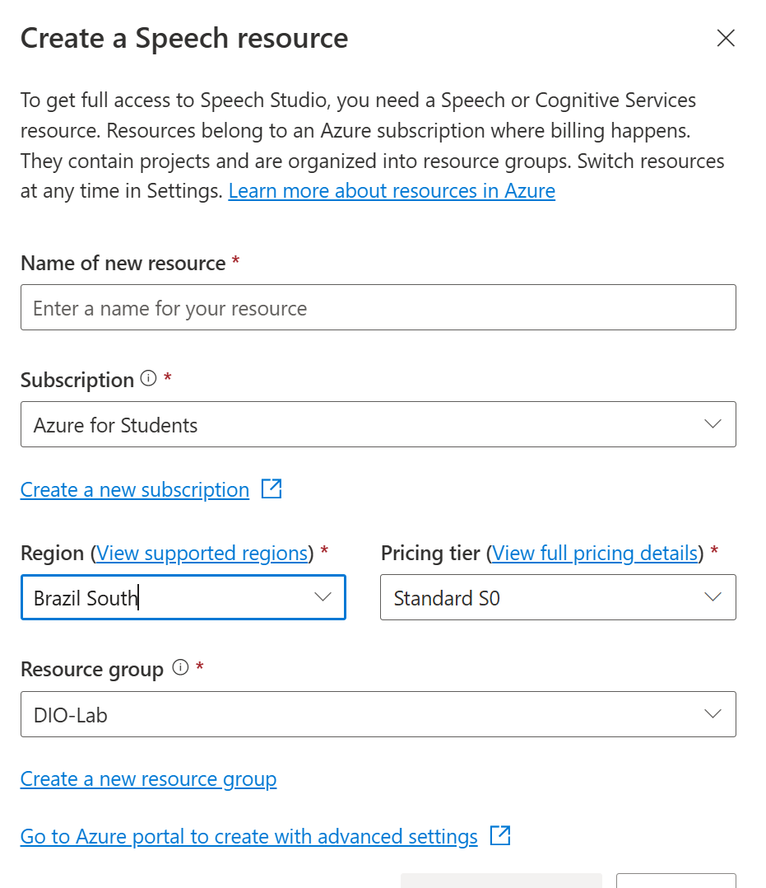
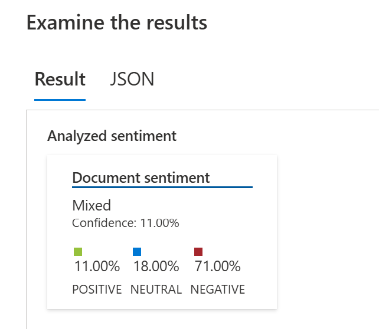
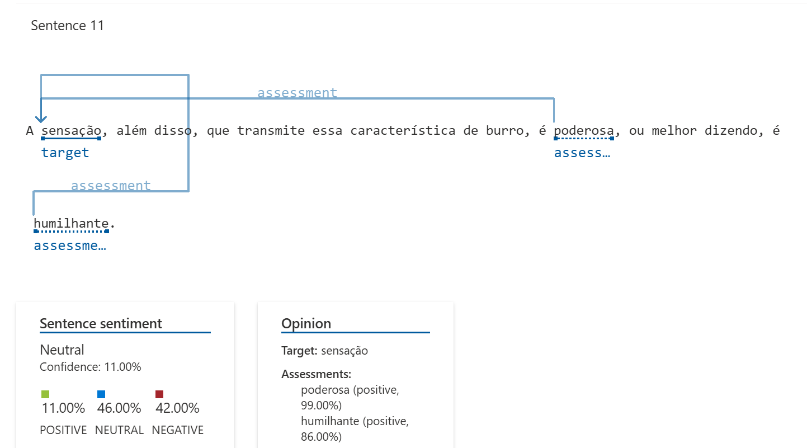

# Análise de Sentimentos com Language Studio no Azure AI
Este repositório documenta a experiência prática com as ferramentas Azure Speech Studio e Language Studio, focando na análise de fala e linguagem natural. O objetivo foi desenvolver habilidades práticas na criação de soluções baseadas em inteligência artificial voltadas para voz e linguagem, conforme proposto no desafio da DIO.

# Objetivos de Aprendizagem
Ao concluir este desafio, fui capaz de:

- Aplicar os conceitos aprendidos em um ambiente prático.

- Documentar processos técnicos de forma clara e estruturada.

- Utilizar o GitHub como ferramenta para compartilhamento de documentação técnica.

# Descrição do Desafio
Este laboratório teve como objetivo praticar e aprofundar o uso das ferramentas Azure Speech Studio e Language Studio, focando na análise de fala e linguagem natural. O objetivo foi desenvolver habilidades práticas na criação de soluções baseadas em inteligência artificial voltadas para voz e linguagem. O entregável é um repositório organizado contendo anotações e insights adquiridos durante a prática, servindo como material de apoio para estudos e futuras implementações.

# Ferramentas Utilizadas
- Azure Speech Studio: Para trabalhar com recursos de fala.

- Azure Language Studio: Para análise de linguagem natural, incluindo análise de sentimento.

- Azure Portal: Para gerenciamento de recursos e assinaturas.

# Detalhes da Implementação e Observações
Durante a execução do laboratório, segui os passos para criar os recursos necessários e testar as funcionalidades.

.

# Problemas Encontrados e Soluções
Um ponto de atenção durante o processo foi a necessidade de registrar o provedor de recursos Microsoft.CognitiveServices no Azure Portal. Inicialmente, encontrei um erro que impedia a criação de recursos relacionados.

## Passos para Resolver o Problema de Registro:

1. Acessar o Azure Portal [ Azure](https://portal.azure.com/).

2. Navegar até Assinaturas na barra de pesquisa superior.

3. Selecionar a assinatura específica onde os Cognitive Services seriam implantados.

4. No menu esquerdo da "blade" da assinatura, em "Configurações", clicar em Provedores de recursos.

5. Pesquisar por _CognitiveServices_ no campo "Filtrar por nome...".

6. Identificar _Microsoft.CognitiveServices_. Se o status fosse "NotRegistered", clicar nele e em seguida no botão Registrar na parte superior.

Após o registro, a criação dos recursos ocorreu sem problemas, como demonstrado na imagem abaixo para a criação do recurso Speech:

# Análise de Sentimento com Language Studio
Um aspecto interessante notado durante a análise de sentimento foi a interpretação de frases com sarcasmo ou ironia. Por exemplo, em um dos testes, mesmo uma frase que para um humano teria uma conotação pessimista/irônica foi classificada com um grau de positividade.

.

# Exemplo de Análise de Sentimento:

A frase analisada foi: "A sensação, além disso, que transmite essa característica de burro, é poderosa, ou melhor dizendo, é humilhante."

.

- **Sentimento do Documento (Geral):** Misto

- Positivo: 11.00%

- Neutro: 18.00%

- Negativo: 71.00%

- Confiança: 11.00%

- **Sentimento da Sentença:** Neutro

Positivo: 11.00%

Neutro: 46.00%

Negativo: 42.00%

Confiança: 11.00%

# Opinião:

- **Alvo:** "sensação"

- **Avaliações:**

"poderosa" (positivo, 99.00%)

"humilhante" (positivo, 86.00%)

A classificação de "humilhante" como positiva (86%) foi particularmente curiosa e demonstra um desafio comum na análise de sentimentos por IA: a dificuldade em captar nuances como ironia ou sarcasmo, onde o sentido real da palavra pode ser oposto ao seu significado literal em um determinado contexto. Isso reforça a importância de considerar o contexto e, em alguns casos, refinar os modelos para lidar com tais complexidades.

# Recursos Úteis
- **Explore Speech Studio** - [ Speech](https://speech.microsoft.com/).

- **Analyze text with Language Studio** - Learning[Language Studio](https://language.cognitive.azure.com/).

- **GitHub Quick Start** - Repositório com Link para Aulas de Git e GitHub [ Aulas](https://github.com/digitalinnovationone/github-quickstart).

- **GitBook: Formação GitHub Certification** - Material textual sobre GitHub [Certification](https://docs.github.com/en/get-started/showcase-your-expertise-with-github-certifications/about-github-certifications#github-foundations-certification).

- **Documentação do GitHub** - Guia completo para uso do GitHub [ Documentação GitHub](https://docs.github.com/en).

- **GitHub Markdown** - Guia específico para Markdown no GitHub[ Markdown](https://docs.github.com/en/get-started/writing-on-github/getting-started-with-writing-and-formatting-on-github/basic-writing-and-formatting-syntax).